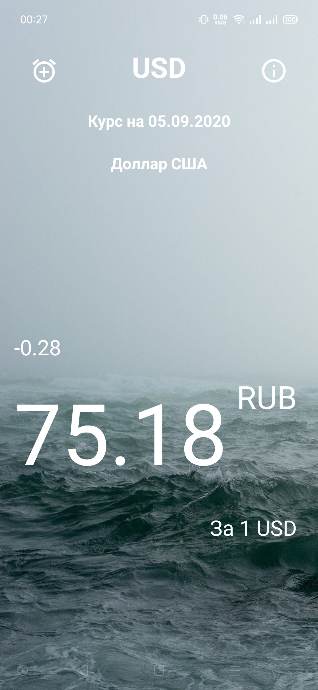
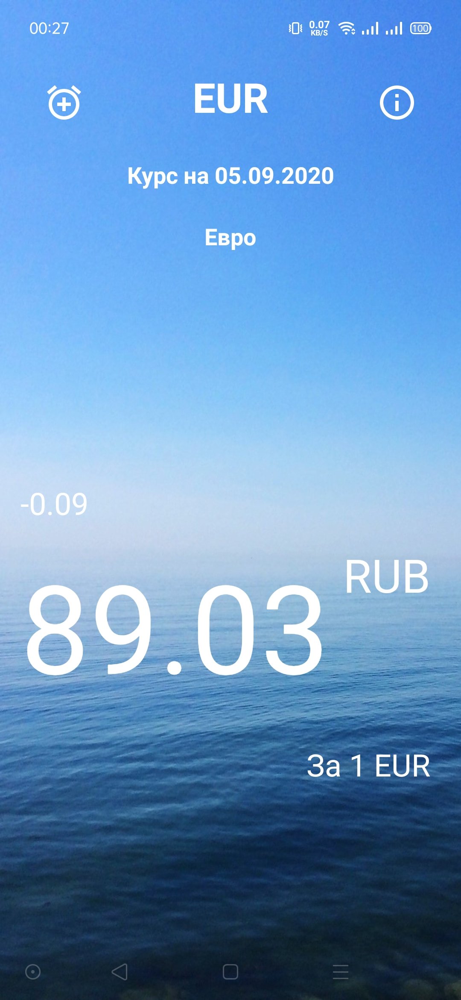
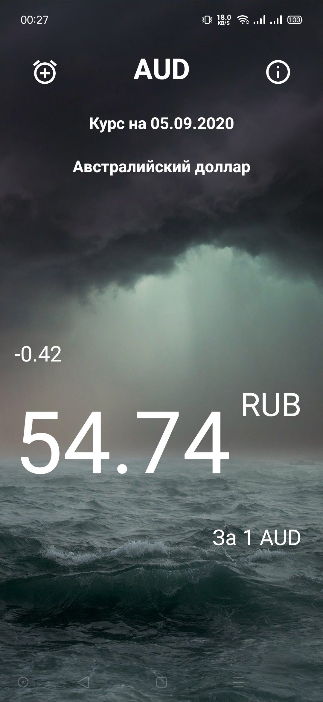
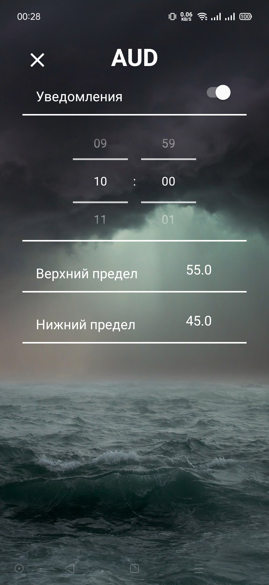
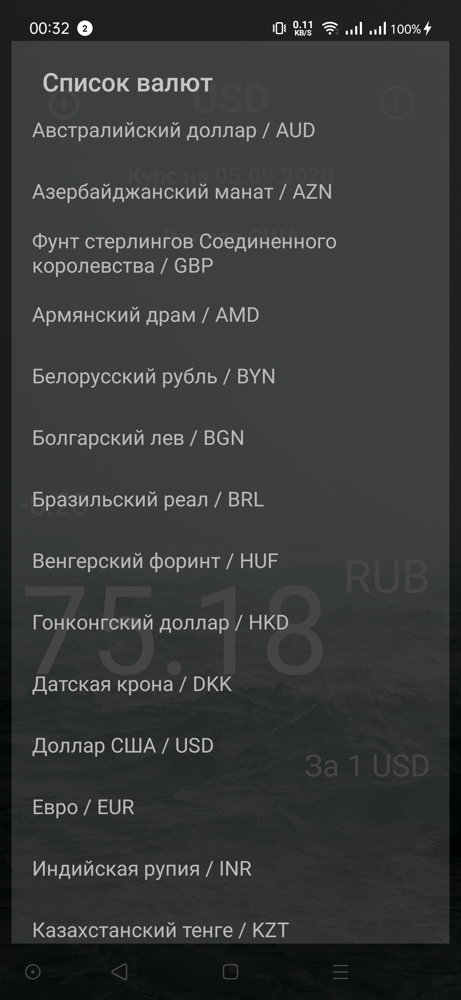

# FinNotify Free
Приложение отображает актуальные данные по курсу рубля относительно национальных валют более тридцати стран.
В приложении доступно:
- Курс Центробанка РФ на завтра;
- Установка оповещений о изменении курса превышающих верхний заданный предел;
- Установка оповещений о изменении курса ниже заданного предела.

Обновление курсов Центробанка РФ происходит в конце каждого рабочего дня (примерно после 15:00).
В бесплатной версии приложения можно установить время оповещения для одной валюты.

Курсы валют обновляются автоматически при запуске приложения или при свайпе вниз. При отсутствии подключения к интернету будут отображены курсы валют, загруженные в последний раз.

Скачать приложение можно на сайте [Google Play](https://play.google.com/store/apps/details?id=com.andysklyarov.finnotifyfree)

# Технологии
Архитектура
- Clean Architecture
- MVVM
- Data Binding

Layout:
- SwipeRefreshLayout
- ConstraintLayout
- Androidx Preferences

Network:
- Retrofit2
- Okhttp3
- Simplexml

Multitask:
- RxJava2
    
Database:
- Room

DI:
- dagger2

## Экраны приложения

    

## API приложения
[Веб-сервис для получения ежедневных данных ЦБ РФ](https://www.cbr.ru/development/DWS/)